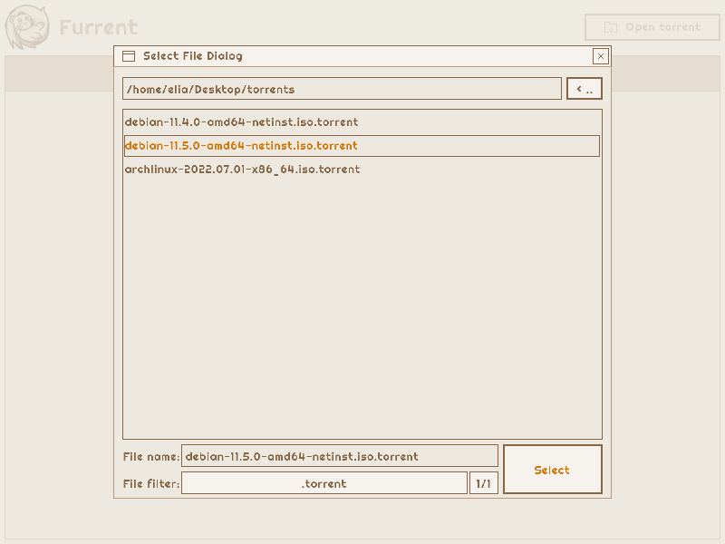
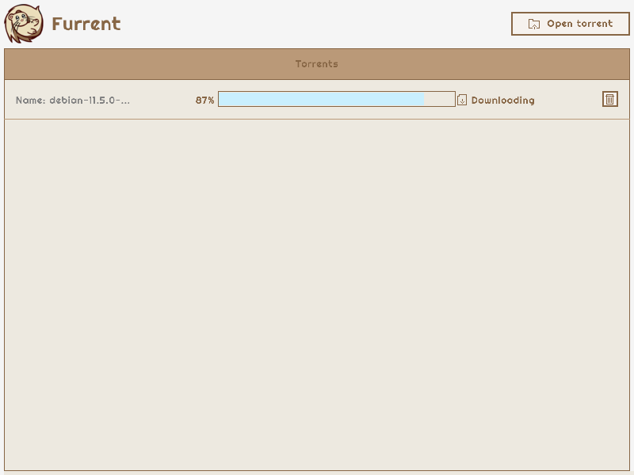
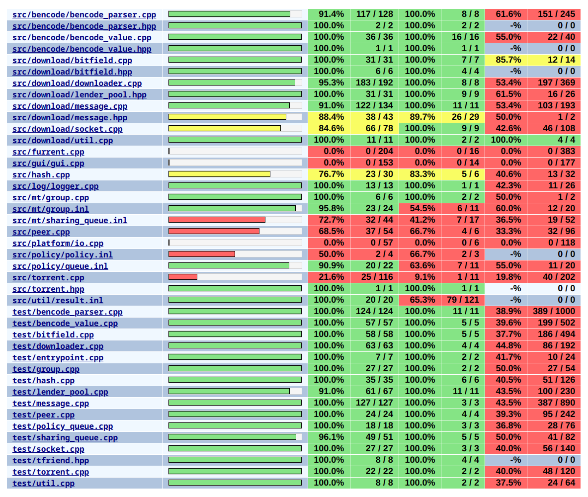

Furrent is a tiny BitTorrent client




## Known limitations

- No [DHT](https://en.wikipedia.org/wiki/BitTorrent#Distributed_trackers) support (tracker-less torrents with
  decentralized peer discovery)
- No [web-seeding](https://en.wikipedia.org/wiki/BitTorrent#Web_seeding) support (seeding via HTTP to bootstrap a new
  torrent and speed up download)
- No [multi-tracker](https://en.wikipedia.org/wiki/BitTorrent#Multitrackers) support (although this is an extension to
  the original protocol, a basic implementation shouldn't prove too hard)
- No [UDP tracker](https://en.wikipedia.org/wiki/UDP_tracker) support (although popular and, for certain torrents, the
  sole option, this is also an extension
  to the original protocol and requires
  implementing [a whole new wire protocol](http://xbtt.sourceforge.net/udp_tracker_protocol.html))

All of these combined unfortunately result in many torrents being undownloadable by Furrent. e.g.:

- [ArchLinux](https://archlinux.org/download/) uses web-seeding and provides no tracker
- [Manjaro](https://manjaro.org/download/) uses a single web-seeder plus an UDP tracker

[Debian](https://www.debian.org/CD/torrent-cd/index.it.html) should work fine instead.

## Building

The requirements are:

- libcurl

When you have them set up, building Furrent is just:

```shell
$ mkdir build
$ cd build
$ cmake ..
$ make furrent
# A "furrent" executable should have appeared in the current directory.
# To copy it in the root bin/ directory also do:
$ make install
```

The instructions that follow assume that you have built Furrent and are in the `build/` directory.

## Documentation

You can build the documentation like so:

```shell
$ make doc
# A "doc" folder should have appeared in the current directory.
# To copy it in the root doc/ directory also do:
$ make install
```

Note that you will need to have Doxygen installed on your system.

## Testing

You can run all tests like so:

```shell
$ make furrent_test
$ make test
```

Additionally, if you have Valgrind installed on your system, you can run the tests using that with:

```shell
$ ctest -C valgrind
```

## Coverage

To enable coverage support, add the `-DCOVERAGE=ON` flag when running `cmake`. Then build the `furrent`
or `furrent_test`
executables. From now on you can use `make coverage` to spawn a `coverage.html` report. Note that you will need to
run the executables that you're interested in before you can see any actual coverage result (and also
run `make coverage`
every time you want to refresh the results).

This step requires you to have `gcov` and `gcovr` installed on your system.

## Sanitizer

We're using the undefined behaviour runtime sanitizer that will print a message to the console in the unfortunate
event that Furrent runs into any UB. To enable it, add the `-DUSAN=ON` flag when running `cmake`.

## Tidy and format

We're using the `clang-format` formatter to maintain a uniform code style and the `clang-tidy` static analyzer (linter)
to catch the most common programming errors right in the editor.

`.clang-format` is taken from the Google convention while `.clang-tidy` is a modified version of a dump
[dump](https://gist.github.com/ArnaudValensi/0d36639fb84b80ee57d0c3c977deb70e) from a recent version of the CLion IDE.

## Code quality
### Coverage
Note that this is without running the GUI



### UB Sanitizer
```
Test project /home/elia/code/furrent_fork/build
    Start 1: tstandard
1/1 Test #1: tstandard ........................   Passed   63.76 sec

100% tests passed, 0 tests failed out of 1

Total Test time (real) =  63.76 sec
```
(Any UB would have produced an error log)

### Valgrind
```
Test project /home/elia/code/furrent_fork/build
    Start 1: tvalgrind
1/1 Test #1: tvalgrind ........................   Passed  1226.90 sec

100% tests passed, 0 tests failed out of 1

Total Test time (real) = 1326.78 sec
```
(Any memory error would have produced an error log)
